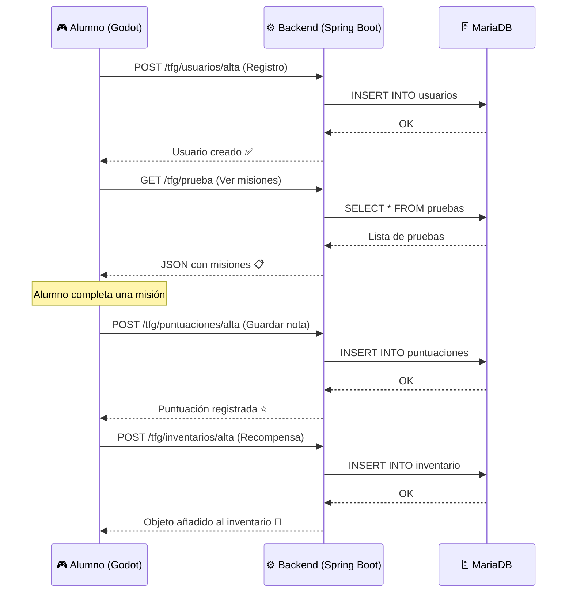

# Análisis Completo del Proyecto POKEDUCATION - TFG

## 1. Visión General del Proyecto

**Pokeducation** es un ecosistema educativo gamificado compuesto por dos repositorios en la organización [tfg-juego-squad](https://github.com/tfg-juego-squad):

| Componente | Repositorio | Tecnología | Estado |
|---|---|---|---|
| **Frontend** | `godot-frontend` | Godot 4.6 + GDScript | En desarrollo inicial |
| **Backend** | `backend-api` | Java 17 + Spring Boot 4.0 | API CRUD funcional |

---

## 2. Análisis del Backend — Qué hace a nivel de Interfaz Gráfica

> [!IMPORTANT]
> El backend **NO tiene interfaz gráfica propia**. Es una API REST pura que provee datos al frontend (Godot). Sin embargo, cada endpoint corresponde a una **pantalla o funcionalidad visual** en el juego.

### 2.1 Mapa Backend → Interfaz del Juego

```mermaid
graph TB
    subgraph "🎮 FRONTEND - Godot (Lo que ve el usuario)"
        LOGIN["Pantalla Login/Registro"]
        DASH["Dashboard / Mapa del Juego"]
        MISIONES["Listado de Misiones/Pruebas"]
        DETALLE["Detalle de una Prueba"]
        INVENTARIO["Inventario del Alumno"]
        PERFIL["Perfil del Usuario"]
        RANKING["Ranking / Puntuaciones"]
    end

    subgraph "⚙️ BACKEND - Spring Boot (Lo que procesa)"
        U_API["/tfg/usuarios"]
        P_API["/tfg/prueba"]
        I_API["/tfg/inventarios"]
        S_API["/tfg/puntuaciones"]
    end

    subgraph "🗄️ BASE DE DATOS - MariaDB"
        DB[(tfg_db)]
    end

    LOGIN -->|POST /alta, GET /{id}| U_API
    PERFIL -->|GET, PUT| U_API
    MISIONES -->|GET| P_API
    DETALLE -->|GET /{id}| P_API
    INVENTARIO -->|GET, POST| I_API
    RANKING -->|GET| S_API

    U_API --> DB
    P_API --> DB
    I_API --> DB
    S_API --> DB
```

### 2.2 Detalle de cada Endpoint y su Relación con la Interfaz

#### `/tfg/usuarios` — Gestión de Usuarios (Pantallas: Login, Registro, Perfil)

| Método | Endpoint | Pantalla asociada | Acción visual |
|---|---|---|---|
| `GET /` | Listar todos | Panel del Profesor → ver listado de alumnos |
| `GET /{id}` | Buscar por ID | Cargar perfil del usuario al iniciar sesión |
| `GET /nombre/{nombre}` | Buscar por nombre | Búsqueda de alumnos por nombre |
| `GET /rol/{rol}` | Filtrar por rol | Separar vista Profesor vs Alumno |
| `POST /alta` | Crear usuario | **Pantalla de Registro** — crear nueva cuenta |
| `PUT /{id}` | Actualizar | **Pantalla de Perfil** — editar datos |
| `DELETE /{id}` | Eliminar | Panel de administración — borrar cuenta |

**Campos del Usuario:**
- `id` (UUID) — Identificador único
- `nombreUsuario` — Nombre mostrado en el juego
- `hashContrasena` — Contraseña encriptada
- `rol` — "ALUMNO" (por defecto) o "PROFESOR"
- `fechaCreacion` — Fecha del registro

---

#### `/tfg/prueba` — Gestión de Pruebas/Misiones (Pantallas: Misiones, Creador de Misiones)

| Método | Endpoint | Pantalla asociada | Acción visual |
|---|---|---|---|
| `GET /` | Listar todas | **Mapa de Misiones** — mostrar todas las pruebas disponibles |
| `GET /{id}` | Detalle de prueba | **Pantalla de Detalle** — ver descripción y puntuación máxima |
| `GET /nombre/{nombre}` | Buscar por nombre | Filtro/búsqueda de misiones |
| `GET /descripcion/{desc}` | Buscar por descripción | Filtro avanzado |
| `GET /puntuacion/{pts}` | Filtrar por puntuación | Ordenar misiones por dificultad |
| `POST /alta` | Crear prueba | **Editor de Misiones (Profesor)** — crear nueva misión |
| `PUT /{id}` | Editar prueba | **Editor de Misiones (Profesor)** — modificar misión existente |
| `DELETE /{id}` | Eliminar prueba | Panel del profesor — borrar misión |

**Campos de la Prueba:**
- `id` (UUID) — Identificador
- `nombre` — Nombre de la misión/prueba
- `descripcion` — Texto descriptivo (contenido de la misión)
- `puntuacionMaxima` — Puntos máximos alcanzables

---

#### `/tfg/inventarios` — Inventario de Objetos (Pantalla: Inventario del Jugador)

| Método | Endpoint | Pantalla asociada | Acción visual |
|---|---|---|---|
| `GET /` | Listar todo | **Inventario completo** |
| `GET /{id}` | Objeto específico | Detalle de un objeto |
| `GET /nombre-objeto/{nombre}` | Buscar por nombre | Filtrar objetos en inventario |
| `POST /alta` | Añadir objeto | **Recompensa** — cuando el alumno completa una misión |
| `PUT /{id}` | Modificar | Admin — actualizar objeto |
| `DELETE /{id}` | Eliminar | Quitar objeto del inventario |

**Campos del Inventario:**
- `id` (UUID) — Identificador
- `nombreObjeto` — Nombre del objeto/recompensa
- `fechaAdquisicion` — Cuándo se obtuvo

> [!NOTE]
> La entidad `Inventario` tiene una FK `usuario_id` en la base de datos, pero la entidad JPA actual **no mapea esta relación**. Esto debería corregirse para vincular objetos a usuarios.

---

#### `/tfg/puntuaciones` — Sistema de Puntuación (Pantalla: Ranking, Progreso)

| Método | Endpoint | Pantalla asociada | Acción visual |
|---|---|---|---|
| `GET /` | Todas las puntuaciones | **Ranking global** |
| `GET /{id}` | Puntuación específica | Detalle de resultado |
| `GET /prueba/{prueba}` | Por prueba | Ver resultados de una misión específica |
| `GET /prueba/nombre/{nombre}` | Por nombre de prueba | Filtrar por nombre de misión |
| `GET /puntos/{puntos}` | Por puntos | Buscar por puntuación obtenida |
| `POST /alta` | Registrar puntuación | **Al completar una misión** — guardar resultado |
| `PUT /{id}` | Actualizar | Corrección de nota por el profesor |
| `DELETE /{id}` | Eliminar | Admin — borrar puntuación |

**Campos de Puntuaciones:**
- `id` (UUID) — Identificador
- `prueba` — Relación ManyToOne con la tabla `Prueba`
- `puntosObtenidos` — Puntos conseguidos
- `fechaCompletado` — Cuándo se completó

> [!NOTE]
> Similar al Inventario, tiene `usuario_id` en SQL pero **no mapeado en JPA**. Se debería añadir la relación `@ManyToOne` con `Usuario`.

---

### 2.3 Infraestructura Docker

```yaml
# docker-compose.yaml levanta:
# 1. MariaDB 10.11 en puerto 3306 (base de datos)
# 2. phpMyAdmin en puerto 8080 (interfaz web para gestionar la BD)
```

**phpMyAdmin (puerto 8080)** sí ofrece una interfaz gráfica web para administrar la base de datos directamente. Es una herramienta de desarrollo, no una interfaz de usuario final.

---

### 2.4 Flujo Visual Completo



---

## 3. Análisis del Frontend (Godot)

### Estado Actual

El frontend en Godot 4.6 tiene actualmente:

| Elemento | Descripción |
|---|---|
| **Nivel 01** | Escena con TileMap (terreno de hierba y tierra) |
| **Personaje** | CharacterBody2D con AnimatedSprite2D |
| **Movimiento** | 4 direcciones (WASD + flechas) a 150px/s |
| **Animaciones** | CaminarDerecha, CaminarIzquierda, CaminarArriba, CaminarAbajo, Quieto |
| **Assets** | Tileset de hierba, arbusto, tierra, sprites de personaje |

> [!WARNING]
> El frontend es todavía un prototipo inicial. **No tiene conexión con el backend** aún. No hay pantallas de login, inventario, misiones ni conexión HTTP implementada.

---

## 4. Segunda Entrega — Adaptada al Proyecto Real

> [!IMPORTANT]
> La plantilla de la Segunda Entrega está pensada para proyectos web (HTML/CSS/componentes). Tu proyecto usa **Godot Engine**, así que he adaptado cada tarea a lo que tiene sentido para un videojuego en Godot + API REST.

---

### TAREA 2.1: Configuración Técnica Avanzada ✅ APLICA

**A. Estructura del proyecto en código**

```
📁 Pokeducation/
├── 📁 godot-frontend/          ← Repositorio Frontend
│   ├── 📁 Assets/              ← Sprites, tilesets, imágenes
│   │   └── 📁 char/            ← Sprites del personaje
│   ├── 📁 Niveles/             ← Escenas de niveles (.tscn + .gd)
│   ├── 📁 Personajes/          ← Escenas de personajes (vacío aún)
│   ├── 📁 Items/               ← Objetos del juego (vacío aún)
│   ├── 📁 Funciones/           ← Scripts globales (vacío aún)
│   └── project.godot           ← Configuración del proyecto
│
└── 📁 backend-api/             ← Repositorio Backend
    ├── 📁 src/main/java/org/example/backendapi/
    │   ├── 📁 control/         ← 4 controladores REST
    │   ├── 📁 model/
    │   │   ├── 📁 entities/    ← 4 entidades JPA
    │   │   └── 📁 dao/         ← 4 interfaces DAO
    │   └── BackendApiApplication.java
    ├── docker-compose.yaml     ← MariaDB + phpMyAdmin
    ├── init.sql                ← Esquema de BD
    └── pom.xml                 ← Dependencias Maven
```

**B. Dependencias necesarias**
- Frontend: Godot 4.6, GL Compatibility mode, Jolt Physics
- Backend: Spring Boot 4.0.3, Spring Data JPA, Spring Data REST, Spring WebMVC, MariaDB JDBC, DevTools
- Infraestructura: Docker, Docker Compose, MariaDB 10.11, phpMyAdmin

**C. Assets**
- Tileset de hierba (`grasstileset.png`)
- Sprite de arbusto (`bush.png`)
- Tileset de tierra (`tierra.png`)
- Sprites de personaje (carpeta `char/`)

---

### TAREA 2.2: Maquetación de la Estructura Base ✅ APLICA (Adaptada)

> En Godot, la "maquetación" son las **escenas (.tscn)** y su jerarquía de nodos.

**A. Layout principal (Escena principal del juego)**
- Escena raíz del juego con sistema de transición entre pantallas
- Autoloads para conexión con API y gestión de estado global

**B. Página de inicio (Dashboard) → Pantalla principal del juego**
- Mapa del mundo con acceso a las misiones
- HUD con información del jugador (nombre, nivel, puntos)

**C. Sistema de navegación → Cambio de escenas**
- Sistema de SceneTree para cambio entre pantallas
- Menú de pausa con acceso a inventario, perfil, ajustes

**D. Estilos globales → Theme de Godot**
- Theme global para todos los nodos Control (botones, labels, panels)
- Paleta de colores consistente
- Tipografía personalizada

---

### TAREA 2.3: Implementación de Componentes ✅ APLICA (Adaptada)

> En Godot, los componentes son **escenas reutilizables** que se instancian.

**A. Componentes atómicos → Nodos base reutilizables**
- Botones estilizados (con hover, pressed, disabled)
- Labels/títulos con estilo del juego
- Iconos de items
- Barras de progreso

**B. Componentes moleculares → Escenas compuestas**
- Tarjeta de misión (nombre + descripción + puntuación)
- Slot de inventario (icono + nombre de objeto)
- Fila de ranking (posición + nombre + puntos)
- Diálogo/popup de confirmación

**C. Componentes de página → Escenas de pantalla completa**
- Pantalla de Login/Registro
- Mapa de misiones
- Vista de detalle de misión
- Inventario
- Ranking/Puntuaciones
- Perfil de usuario

**D. Props y estados iniciales → Exports y Signals**
- Variables `@export` para configurar componentes
- Signals para comunicación entre nodos
- Scripts de conexión HTTP con el backend

---

### TAREA 2.4: Maquetación Responsive ⚠️ APLICA PARCIALMENTE

> En un videojuego Godot, "responsive" se traduce a **soporte de múltiples resoluciones**.

**A. Enfoque resolución base**
- Resolución base: 1920x1080 (o la definida en project.godot)
- Modo de escalado: `canvas_items` stretch mode

**B. Adaptaciones por tamaño**
- Anchors y containers para que la UI se adapte
- Layouts flexibles con VBoxContainer/HBoxContainer

**C. Pruebas en diferentes resoluciones**
- Probar en 1920x1080, 1366x768, 1280x720
- Verificar que sprites y UI no se deforman

**D. Menú responsive**
- Menú principal adaptable al tamaño de ventana

---

### TAREA 2.5: Maquetación de Pantallas Completas ✅ APLICA (Adaptada)

> Estas son las **escenas de Godot** que deben estar implementadas:

| # | Pantalla (Web) | Equivalente en Godot | Estado |
|---|---|---|---|
| 1 | Dashboard | Mapa del mundo / Pantalla principal | ⚠️ Parcial (solo nivel_01) |
| 2 | Listado de elementos | Listado de misiones disponibles | ❌ No implementado |
| 3 | Detalle de un elemento | Vista detalle de una misión | ❌ No implementado |
| 4 | Formulario creación/edición | Editor de misiones (paneles de profesor) | ❌ No implementado |
| 5 | Perfil / Configuración | Pantalla de perfil del jugador | ❌ No implementado |
| 6 | Login/Registro | Pantalla de autenticación | ❌ No implementado |
| 7 | Página de error 404 | Pantalla de error de conexión | ❌ No implementado |

**Requisitos:**
- Cada pantalla debe seguir los bocetos del TFG (páginas 7-9 del PDF del TFG)
- Navegación entre pantallas funcional (cambio de escenas)
- Conexión HTTP con la API REST del backend

---

### TAREA 2.6: Accesibilidad Básica ⚠️ APLICA PARCIALMENTE

**A. Semántica → Jerarquía de nodos clara**
- Nodos con nombres descriptivos
- Grupos para clasificar elementos interactivos

**B. Controles alternativos**
- Soporte de teclado completo (ya implementado WASD + flechas)
- Posibilidad de gamepad (parcialmente configurado en project.godot)

**C. Contraste y legibilidad**
- Texto legible sobre el fondo del juego
- Tamaño de fuente adecuado en los menús

---

### TAREA 2.7: Documentación ✅ APLICA

**A. Documentación de escenas/componentes**
- Documento markdown que liste todas las escenas y scripts
- Descripción de cada componente reutilizable
- Variables exportadas y signals de cada componente

**B. README actualizado de ambos repositorios**
- Estado actual del desarrollo
- Cómo ejecutar el proyecto (Godot + Docker + Backend)
- Estructura del proyecto
- Decisiones técnicas relevantes

---

## 5. Resumen: Qué Puntos Aplican y Cuáles No

| Tarea | ¿Aplica? | Notas |
|---|---|---|
| 2.1 Config. Técnica | ✅ Sí | Documentar estructura, dependencias y assets |
| 2.2 Estructura Base | ✅ Sí (adaptada) | Escenas principales de Godot + conexión API |
| 2.3 Componentes | ✅ Sí (adaptada) | Escenas reutilizables en vez de componentes web |
| 2.4 Responsive | ⚠️ Parcial | Soporte multi-resolución en vez de mobile-first |
| 2.5 Pantallas Completas | ✅ Sí (adaptada) | Las 7 pantallas como escenas de Godot |
| 2.6 Accesibilidad | ⚠️ Parcial | Adaptar a controles de videojuego |
| 2.7 Documentación | ✅ Sí | README + doc de componentes |

> [!CAUTION]
> **Lo que NO tiene sentido hacer:**
> - Crear interfaces HTML/CSS (el frontend es Godot, no web)
> - WCAG/ARIA (son estándares web, no de videojuegos)
> - Storybook (es una herramienta de componentes web)
> - Mobile-first responsive design (aplica multi-resolución en su lugar)

---

## 6. Problemas Detectados en el Código Actual

### Backend
1. **`Inventario.java`** — No mapea la relación `usuario_id` con `@ManyToOne`. En la BD existe la FK pero en JPA no está.
2. **`Puntuaciones.java`** — Tiene `@ManyToOne` con `Prueba` pero **falta la relación con `Usuario`** (la FK `usuario_id` existe en SQL).
3. **Sin capa de servicios** — Los controladores llaman directamente a los DAOs. Falta la capa `Service` que la arquitectura del TFG dice que debería tener.
4. **Sin seguridad** — No hay Spring Security ni autenticación implementada. Las contraseñas no se encriptan con BCrypt como indica el TFG.
5. **Sin validaciones** — `@Validated` se usa pero no hay constraints (`@NotNull`, `@Size`, etc.) en las entidades.

### Frontend
1. **Sin conexión HTTP** — No hay scripts que llamen a la API REST.
2. **Sin sistema de UI** — No hay pantallas de menú, login, inventario.
3. **Solo movimiento básico** — Un personaje que se mueve en 4 direcciones.
4. **Carpetas vacías** — `Items/`, `Personajes/`, `Funciones/` están vacías.

---

## 7. Próximos Pasos Recomendados

1. **Clonar el backend como submódulo o carpeta** en el proyecto local para tener todo junto
2. **Corregir las entidades JPA** (añadir relaciones faltantes usuario_id)
3. **Implementar las pantallas de Godot** (login, misiones, inventario, ranking)
4. **Crear la conexión HTTP** desde Godot al backend (HTTPRequest node)
5. **Generar el documento de la Segunda Entrega** adaptado al proyecto real
